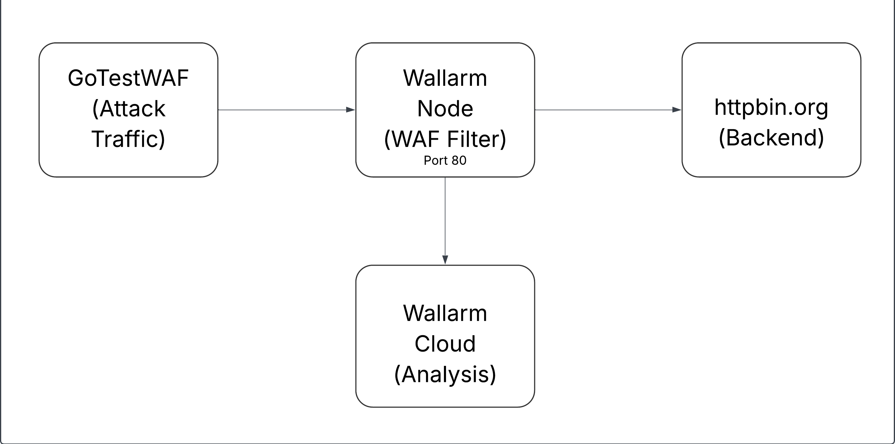
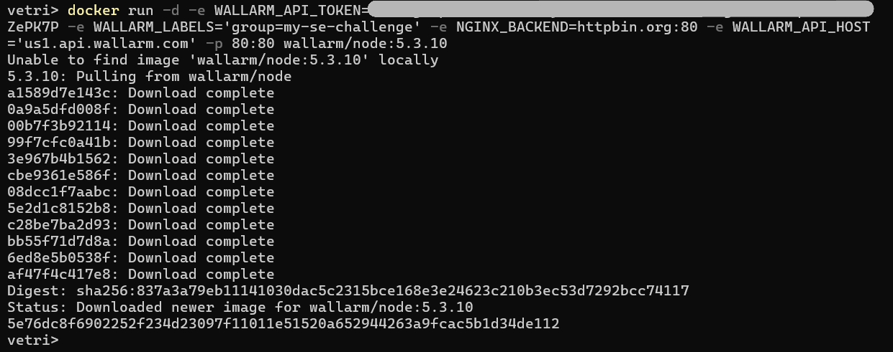
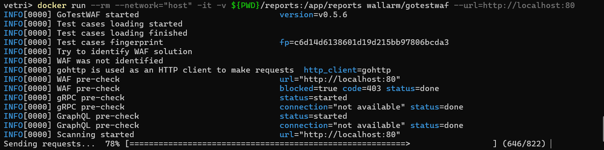
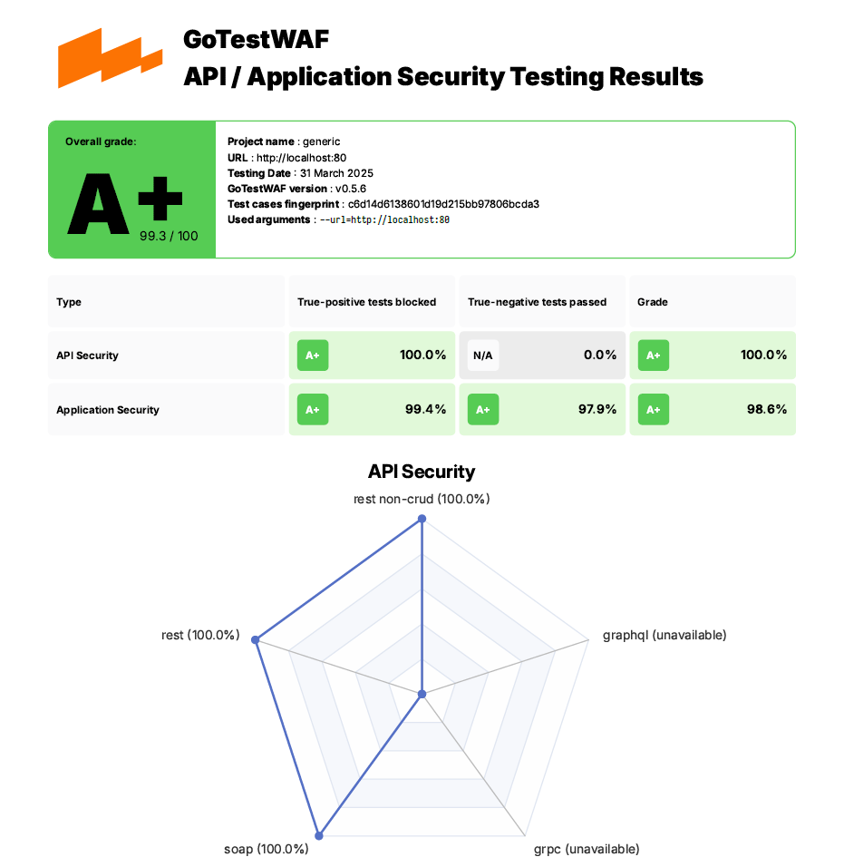

# Wallarm Solutions Engineer Technical Evaluation

## Overview

This project demonstrates the deployment and configuration of a Wallarm Filtering Node using Docker as the deployment method. The implementation focuses on creating a secure environment where traffic is filtered through the Wallarm node before reaching the backend application.

I selected Docker for this deployment due to its simplicity and portability. Docker containers allow for consistent deployment across different environments and make it easy to replicate the setup in various scenarios.

## Architecture Diagram


## Deployment Process

### Prerequisites
- Docker installed on the host machine
- Wallarm account with API access token

### Step 1: Deploy Wallarm Filtering Node
```bash
docker run -d --name wallarm-node \
  -e WALLARM_API_TOKEN=<your_api_token> \
  -e WALLARM_LABELS='group=my-se-challenge' \
  -e NGINX_BACKEND=httpbin.org:80 \
  -e WALLARM_API_HOST='us1.api.wallarm.com' \
  -p 80:80 wallarm/node:5.3.10
```


### Step 3: Verify Wallarm Node Deployment
Check if the container is running:
```bash
docker ps -a | grep wallarm-node
```

Verify logs for successful initialization:
```bash
docker logs wallarm-node
```

### Step 4: Verify Backend Connectivity
Connect to the Wallarm node container:
```bash
docker exec -it wallarm-node bash
```

Test connectivity to the backend:
```bash
ping httpbin.org
curl -v httpbin.org/get
```

## Testing with GoTestWAF

### Install GoTestWAF
Using Docker:
```bash
docker pull wallarm/gotestwaf

```

### Run Attack Simulations
```bash
docker run --rm --network="host" -it -v ${PWD}/reports:/app/reports wallarm/gotestwaf \
  --url=http://localhost:80
```



### Analyze Test Results
After running GoTestWAF, reports was generated in the `reports` directory:
- pdf report: [report.pdf](./report/waf-evaluation-report-2025-March-31-01-52-11.pdf)

## Issues Encountered and Resolutions

### Issue 1: Incorrect Port Configuration
**Problem:** Initial attempt to run GoTestWAF against port 8080 failed as the WAF was actually configured on port 80.

**Error Message:**
```
ERRO[0000] caught error in main function error="WAF was not detected. Please use the '--blockStatusCodes' or '--blockRegex' flags. Use '--help' for additional info. Baseline attack status code: 200"
```

**Solution:** Modified the GoTestWAF command to target port 80 instead of port 8080.


## Results

### WAF Detection Rate


## Configuration Details

### Wallarm Node Configuration
The Wallarm node was configured with the following key settings:
- **Mode:** Block (Active protection)
- **Backend:** httpbin.org (standard HTTP testing service)
- **API Host:** us1.api.wallarm.com (Wallarm Cloud for analysis)

## Conclusion

This deployment successfully demonstrates the implementation of a Wallarm WAF filtering node using Docker.

The Docker-based deployment provides several advantages:
1. **Ease of deployment** - Simple configuration through environment variables
2. **Scalability** - Can be easily integrated into larger container orchestration systems
3. **Consistency** - Reproducible deployment across different environments

The implementation follows Wallarm's best practices as documented in the official documentation and demonstrates the effectiveness of the WAF in protecting web applications.

## References
- [Wallarm Documentation](https://docs.wallarm.com/)
- [Wallarm Docker Deployment Guide](https://docs.wallarm.com/admin-en/installation-docker-en/)
- [Wallarm API Documentation](https://docs.wallarm.com/api/overview/)
- [GoTestWAF GitHub Repository](https://github.com/wallarm/gotestwaf)
- [Docker Documentation](https://docs.docker.com/)

## Notes on Documentation Use
Throughout this implementation, I heavily relied on Wallarm's official documentation:

1. Used the Docker installation guide to understand environment variables and deployment options
2. Referenced the API documentation to properly configure the API token and node registration
3. Consulted the WAF configuration guide to understand blocking modes and detection settings
4. Utilized the GoTestWAF documentation to properly test the WAF implementation

